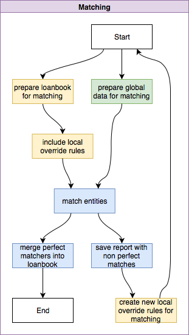

This vignette describes how matching process works. It can be built based on standard blocks of functionality provided by package. Matching process set's up requirements to data which is taken as an input; then it performs processing steps and produces several ouput results.

Whole process is depicted on diagram below and consist of three steps:

1. prepare data for matching;
2. match assets and clients from loanbook against assets and companies from asset-level data;
3. merge perfect matches into loanbook data.

## Prerequisites

in order to perform mathcing two datasets are required:

* loanbook data represented in unified format (set of columns and their names);
* asset-level-data from global databases.

Requirements for loanbook are described in "Data Preparation" vignette; loanbook should contain attributes that represent sector classification and information about asset, borrower, economic ultimate parent of borrower and legal ultimate parent. Requirements for asset-level data are similar: there should be columns which represent sector, asset, direct owner, ultimate parent. Table below provides more technical details on it.

| # | Loanbook data | Asset level data |
|--:|-------------------------|-------------------------|
| 1 | `Sector.Classification` | `Sector.Classification` |
| 2 | `Asset.ID` & `Asset Name` | `Asset.ID` & `Asset Name` |
| 3 | `Borrower.ID` & `Borrower.Name` | `Direct.Owner.ID` & `Direct.Owner.Name` |
| 4 | `EUP.ID` & `EUP.Name`   `LUP.ID` & `LUP.Name` | `Ultimate.Parent.ID` & `Ultimate.Parent.Name` |

## Prepare data for matching

Matching functionality is universal and it has generic input & output (see "Matching" section below). In order to compare loanbook with asset level data is should be first prepared for matching. 

### Data reshaping

That means we should:

* on the left-hand (loanbook data) side: take assets, borrowers, ultimate parents and put them together;
* on the right-hand (asset-level data) sida: take assets, direct owners, ultimate parents and put them together.

For loanbook data it might look like that: 

original structure 

|..| As-t ID | Asset Name | Bor-r ID | Borrower Name | EUP ID | EUP Name | LUP ID | LUP Name |..|
|--|----|------------|----|------------|----|------------|----|------------|--|
|..| A1 | Asset 1    | C1 | Company 1  | C6 | Company 6  | C7 | Company 7  |..|
|..| A2 | Asset 2    | C1 | Company 1  | C6 | Company 6  | C7 | Company 7  |..|
|..| A3 | Asset 3    | C2 | Company 2  | C5 | Company 5  | C5 | Company 5  |..|
|..| A3 | Asset 3    | C2 | Company 2  | C5 | Company 5  | C5 | Company 5  |..|
|..| A4 | Asset Four | C3 | Company 3  | -  | -          | -  | -          |..|

will be translated into 
   
| Level    | ID | Value Type | Original.Value |
|----------|----|------------|----------------|
| Asset    | A1 | Asset Name | Asset 1        |
| Asset    | A2 | Asset Name | Asset 2        |
| Asset    | A3 | Asset Name | Asset 3        |
| Asset    | A4 | Asset Name | Asset Four     |
| Borrower | C1 | Legal Name | Company 1      |
| Borrower | C2 | Legal Name | Company 2      |
| Borrower | C3 | Legal Name | Company 3      |
| EUP      | C5 | Legal Name | Company 5      |
| EUP      | C6 | Legal Name | Company 6      |
| LUP      | C5 | Legal Name | Company 5      |
| LUP      | C7 | Legal Name | Company 7      |

And for asset level data it looks very similar:

original data

|..| As-t ID | Asset Name | Own-r ID | Owner Name | UP ID | Ult Par-t Name |..|
|--|----|------------|----|------------|----|------------|--|
|..| A1 | Asset 1    | C1 | Company 1  | C6 | Company 6  |..|
|..| A2 | Asset 2    | C1 | Company 1  | C6 | Company 6  |..|
|..| A3 | Asset 3    | C2 | Company 2  | C5 | Company 5  |..|

will be translated into 
   
| Level    | ID | Value Type | Original Value |
|----------|----|------------|----------------|
| Asset    | A1 | Asset Name | Asset 1        |
| Asset    | A2 | Asset Name | Asset 2        |
| Asset    | A3 | Asset Name | Asset 3        |
| Owner    | C1 | Legal Name | Company 1      |
| Owner    | C2 | Legal Name | Company 2      |
| Parent   | C5 | Legal Name | Company 5      |
| Parent   | C6 | Legal Name | Company 6      |

This data is additionally "blocked" by Sector classification values to run matching within correspondent blocks - sectors (and sources of information for asset-level data).

This preparation step can be done automatically by calling `process.prepLBK4match` - to prepare loanbook data and `process.prepALD4match` to prepare asset-level data. Both functions take data frames as an input and return rearranged data frames as a result.

There are also 2 low-level functions that allow user to specify what columns should be converted into matching compatible format. These functions are `addLBK4matching` and `addALD4matching` to process loanbook and asset-level data respectively. Functions are internal and can't be accessed by user scripts.

### Simplification of names

Matching process by default uses names. Because this information is always available. However names may be typed differently in different sources. Some sources provide name with acronyms, some use only basic set of 26 latin letters, others use extentions (`r "\U0160"` vs S, `r "\U0152"` vs OE, etc.). In order to make matching more robust to this kind of deviations, names should be simplified first. 

simplification process implemented as `simplifyName` function and consist of following steps:

1. put characters into lower case (NAME -> name);
1. translate characters into basic 26 letters (`r "stra\u00DFe"` -> strasse)
1. use common replacements (`r "a and b"` -> `r "a & b"`)
1. remove redundand whitespaces (a\_b\_\_c\_\_\_ -> a b c, _where \_ represents whitespace_)
1. use common acronyms (limited -> ltd, company -> co, public ltd co -> plc, etc.)
1. clean result from all whitespaces but keep ownership type as separate word (na me llc -> name llc)

Applying simplification to both loanbook data and asset-level data allows to keep information but reduce difference in typing, thus improve matching results.

Simplified values are stored in matching preparation results as `Match.Value` and used in matching, if simplification is not applied then `Matched` value is equal to `Original.Value` (see mathcing section)

### Including override rules

Based on runs users analyze matching reports and can decide to enforce specific pairs to become matches. This is information is stored in the same format as data for matching (see section "Preparation results") so it can be easily united. All override rules are added into dataset for matching and being processed by matching procedure.

### Preparation results

After preparation for mathcing loanbook data is stored in a dataset of the following format:

* `Source` - source of information, loanbook or override file
* `Level` - Asset / Borrower / EUP (Economic Ultimate Parent) / LUP (Legal Ultimate Parent)
* `ID`* - Asset ID / Company ID
* `Name` - Asset Name / Company Name
* `Relation` - Relation between entity represented by `ID` and entity which has `Original.Value` of `Value Type`; for example when borrower has issued equity securities then relation will be = `Id` (borrower itself) and value type = `Share ISIN` (ISIN code of equity secutiry) 
* `Value.Type` - in case of name it is `Legal Name`; it can also be LEI code; Bloomberg ticker and other recognized codes; this is information field
* `Original.Value`* - original value as it exists in internal sources of institution that provides loanbook (before any modification / simplification) 
* `Match.Value`* - value that should be used for matched (after modifications; name simplification)
* `Sector.Classification`* - Sector classification accoring to 2Dii internal taxonomy it defines subset of names in asset level data to be matched against (segment of dictionary)

Attributes market with `*` are mandatory and participate in matching; other attributes of file are for information and help to keep track of data origin and purpose.

Asset level data is stored in following format:

* `Level` - Asset / Direct Owner / Ultimate Parent level
* `ID` - Asset ID / Company ID
* `Original.Value` - original value as it exists in external sources of data (such as asset-level data)
* `Match.Value` - value that should be used for matched (after modifications; name simplification)
* `Sector.Classification` - Sector classification accoring to 2Dii internal taxonomy it defines subset of names in asset level data to be matched against (segment of dictionary)

All attributes are madatory and should present in a dataset.

## Matching

Core matching function (`matchNames`) takes vector of names and compares each of them against vector of dictionary entries, cutting off all matches with scores below threshold. As a result of comparison (measuring similarity) it resturns pairs with score. Score is a measure of similarity and stays in range 0 .. 1. 1 is perfect match; 0 - absolutelyt no similarity. Result of matching has following set of fields: 

* `Name` - Asset / Company name from loanbook;
* `Dictionary` - Asset / Company name from Asset-level data;
* `Score` - Matching score (between 0 and 1);
* `Segment` - Block, to which Name value and Dictionary value belong both.

This simple match results are then joined back with loanbook data and asset-level data. As a result there is a dataset which contains all columns from loanbook (with `.local` suffix) and all columns from asset-level data (with `.global` suffix) and `Match.Score` - representing match score. After that all resutls are split into 2 main groups: prefect matches and matches that require verification. these groups are described in specific sections below.

### Perfect matches

Perfect mathes are result of match process (joined back to loanbook and asset-level data) that are directly used for megring them into loanbook for further analysdis. Only Match.Scores >= `r pacta::match.score.perfect` treated as perfect matches. Perfect match score value can be observed via `pacta::match.score.perfect` call.

### Matches that require verification
Matches that require verification are stored in separate dataset (and file). Their score should be in range between threshold and perfect (latter is excluded); default setting is: `r paste(pacta::match.score.threshold, "<= Score <", pacta::match.score.perfect)`. Default Threshold value can be examined by call `pacta::match.score.threshold`. Structure of file is similar to file with perfect matches. Data in dataset should be examined and cases, which are true matches, should be copied into manual override dataset (see preparation section): user needs to copy all `.local` fields and replace `Original Value` and `Match Value` with values from `.global` side of dataset with match results.

## Merging match results into loanbook

After matching step is complete results of matching should be mergedincorporated into loanbook. This process is called merging. As an ideal result of merge process - each loanbook line is linked to asset-level data. Since matches may occur on several levels simultaniously (loanbook's Borrower linked to Direct Owner from asset-level data, Economic Ultimate Parent - to Ultimate Parent, etc) we should define what levels can be matched between each other. This information is represented in table below

Compatibility of levels:

|    Loanbook level           | ALD:   Asset  | ALD:   Owner  | ALD:   Parent |
|-----------------------------|:------:|:------:|:------:|
| 1. Asset                    | Y      | Y      | Y      |
| 2. Borrower                 | -      | Y      | Y      |
| 3. Economic Ultimate Parent | -      | -      | Y      |
| 4. Legal Ultimate Parent    | -      | -      | Y      |

Selection of best level is done based on priorities for loanbook level data as they are stated above: Asset > Borrower > EUP > LUP. That means matches on Asset level have highest priority and must be considered first, then Borrower level goes, etc.

As a result of best match identification Loanbook data is enriches with following set of fields:

* `Best.Match.Level` - level of loanbook to which mathcing applies (leftmost row in the table above);
* `Best.Match.link.to.Level` - level of asset data to which matching applies (header row except first element);
* `Best.Match.link.to.ID` - ID from asset-level data linked to loanbook record;
* `Best.Match.link.to.Name` - Name of asset / company from asset-level data linked to loan record.
